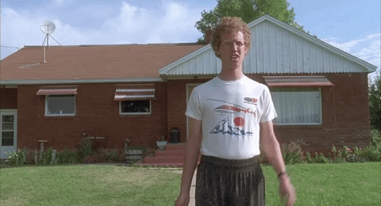

<div align="center">
  
</div>

<h1 align="center">Hey friend! My name's Dima
  
</h1>

<h3 align="center">...but friends call me for a beer
  <a href="https://stackoverflow.com/index.php"> 🍺 </a>
  🙄
</h3>

<div align=center>
  
</div>

<h2 align="center">About 👉👈</h2>

<br>

```javascript
class FrontEndDeveloper {
  constructor(name) {
    this.name = name;
  }

  sayHi() {
    console.log(`Hey friend, I'm ${this.name}. Nice to meet you!`);
  }
}

const DmitryKaras = new FrontEndDeveloper("Dmitry Karas");

const techStack = [
  "HTML",
  "CSS",
  "SASS",
  "JavaScript",
  "React",
  "React Router",
  "Redux",
  "Redux Toolkit",
  "Emotion",
  "Webpack",
  "Parcel",
  "Axios",
  "Firebase",
  "Handlebars",
  "Git",
  "NPM",
  "VS Code",
  "Figma"
];

const softSkills = [
  "Teamwork",
  "Collaboration",
  "Communication",
  "Responsibility",
  "Willingness to learn",
  "Emotional intelligence",
  "Friendliness",
  "Problem solving"
];

const interests = [
  "Mountain bike",
  "Fast cars",
  "Loud music",
  "Fantastic movies",
  "Acoustic guitar",
  "Pretty girls",
  "Cold beer"
];

const contacts = {
  phone: "+38(068)511 56 96",
  email: "dmitrythekaras@gmail.com",
  telegram: "@the_karas",
  linkedIn: "linkedin.com/in/dmitry-karas/"
};

DmitryKaras.about = {
  techStack: [...techStack],
  softSkills: [...softSkills],
  interests: [...interests]
};

DmitryKaras.contacts = { ...contacts };

DmitryKaras.sayHi();
```

<h2 align="center">Stats 👨‍💻</h2>

<br>

<div align=center>
  
  
</div>

<h2 align="center">Social 🙄</h2>

<br>

<div align="center">
  <a href="https://www.linkedin.com/in/dmitry-karas/">
    
  </a>
  
  <a href="https://www.facebook.com/karas.dmitry/">
    
  </a>
  
  <a href="mailto:dmitrythekaras@gmail.com">
    
  </a>
  
  <a href="https://telegram.me/the_karas">
    
  </a>
  
  <a href="https://www.instagram.com/dmitriy_karas">
    
  </a>
</div>


<hr>

<h4 align="center">Try to find the easter egg on the page! 🥚 🐇 </h4>

<p align=center><i>tip: cold 'n foamy 😉</i></p>

<hr>
